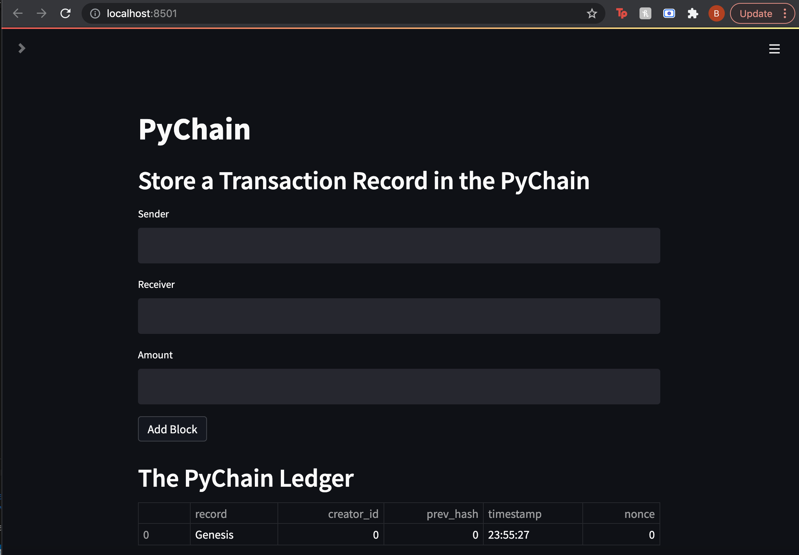
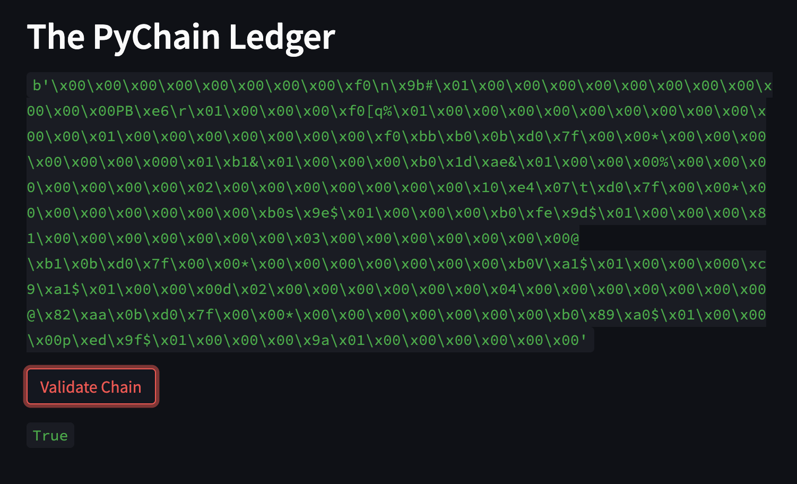

# Challenge-18
The purpose of this challenge was to build a blockchain-based ledger system that is complete with a user-friendly web interface. This ledger will allow partner banks to conduct financial transactions and to verify the integrity of the data in the ledger.

*See below images to view the validity of the blockchain*

## First look of the webiste

## View of a couple of blocks added to the blockchain

### Note: The block chain is valid
